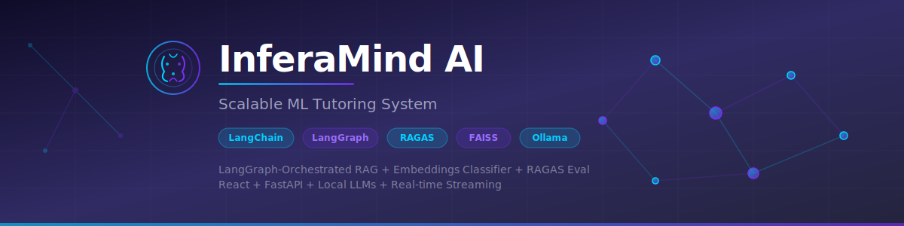

<p align="center">
  
</p>

<h1 align="center">InferaMind AI: Scalable ML Tutoring System with LangChain, LangGraph & RAG Pipelines</h1>

<p align="center">
  A full-stack RAG teaching assistant for Andrew Ng's ML Specialization — with a <b>3-way LangGraph classifier</b> that answers from video transcripts via RAG <i>or</i> from the LLM's own ML knowledge when content isn't in the videos.<br/>
  Built with <b>React</b>, <b>FastAPI</b>, <b>LangChain</b>, <b>LangGraph</b>, <b>Groq</b>, and <b>Ollama</b>.<br/>
  Features <b>provider-agnostic LLM abstraction</b>, <b>RAGAS evaluation metrics</b>, and a <b>4-job CI/CD pipeline</b>.
</p>

<p align="center">
  
  
  
  
  
  
  
  
  
</p>

---

> **300-char description:** InferaMind AI is a RAG-powered ML tutoring system using LangGraph's 3-way classifier to answer from course videos (FAISS + BGE-M3) or the LLM's own knowledge via Groq/Ollama. Built with React, FastAPI, LangChain, RAGAS eval metrics, JWT auth, SSE streaming, and CI/CD.

---

## Why Groq + Ollama?

This project uses a **dual-provider architecture** — not because it's trendy, but because each solves a different problem:

| | Groq | Ollama |
|---|---|---|
| **Role** | LLM generation (answering questions) | Embeddings (BGE-M3 for search + classification) |
| **Why** | Groq runs **LLaMA 3.3 70B** at ~500 tokens/sec via their LPU cloud — a 70B model gives dramatically better tutoring answers than a local 3B model | Groq **doesn't offer an embeddings API**, so Ollama handles all embedding computation locally |
| **Cost** | Free tier (30 req/min) | Free (local) |
| **Fallback** | If no Groq API key is set, generation falls back to Ollama automatically | Always required for embeddings |

You can run the entire app with just Ollama (set `LLM_PROVIDER=ollama`). Groq makes it faster and smarter, but isn't required.

## Architecture

```
                    +-------------------+
                    |   React Frontend  |
                    |   (Vite + React)  |
                    +--------+----------+
                             |
                      REST + SSE Streaming
                             |
                    +--------+----------+
                    |  FastAPI Backend   |
                    |                   |
                    |  +-------------+  |
                    |  | LangGraph   |  |
                    |  | RAG Pipeline|  |
                    |  | - Classify  |  |  <- 3-way: in-video / ML-general / off-topic
                    |  | - Retrieve  |  |  <- FAISS + BGE-M3 semantic search
                    |  | - Direct    |  |  <- LLM answers from own ML knowledge
                    |  | - Generate  |  |  <- Groq (LLaMA 70B) or Ollama (LLaMA 3.2)
                    |  +------+------+  |
                    |         |         |
                    |  +------+------+  |
                    |  |   RAGAS     |  |  <- Evaluation: precision, recall, faithfulness
                    |  |   Metrics   |  |
                    |  +-------------+  |
                    |                   |
                    +----+----+----+----+
                         |    |    |
                  +------+-+  |  +-+------+
                  | Ollama  |  |  | SQLite |
                  | bge-m3  |  |  | Chat DB|
                  +---------+  |  | Auth DB|
                        +------++ +--------+
                        |  Groq  |
                        | LLaMA  |
                        |  70B   |
                        +--------+
```

## Tech Stack

| Layer      | Technology                          |
|------------|-------------------------------------|
| Frontend   | React 19, Vite, Lucide Icons, React Markdown |
| Backend    | FastAPI, Uvicorn, Pydantic          |
| LLM        | Groq (LLaMA 3.3 70B) or Ollama (LLaMA 3.2) — provider-agnostic via LangChain |
| Embeddings | Ollama BGE-M3 (1024-dim), FAISS inner-product search |
| Orchestration | LangGraph state machine with 3-way conditional routing |
| Classifier | Embeddings-based cosine similarity to course centroid vector |
| Evaluation | RAGAS-style metrics — context precision, context recall, faithfulness, answer relevancy |
| Auth       | JWT (python-jose), bcrypt, HTTPBearer |
| Database   | SQLite (conversations + user auth)  |
| Streaming  | Server-Sent Events (SSE) + WebSocket |
| Testing    | pytest (58 tests — unit + integration) |
| DevOps     | Docker, GitHub Actions CI/CD (4-job pipeline: lint, test, build, Docker) |

## Features

- **3-Way LangGraph Classification** — queries are routed to video RAG, direct LLM knowledge, or rejection based on cosine similarity thresholds
- **Provider-Agnostic LLM** — swap between Groq (cloud, 70B) and Ollama (local, 3B) via one env var; auto-fallback if Groq key is missing
- **RAG from Video Transcripts** — FAISS + BGE-M3 retrieves relevant transcript chunks with similarity scores and timestamps
- **Direct ML Knowledge** — questions about ML topics not in the videos get answered by the LLM from its own training knowledge, with a clear disclaimer
- **RAGAS Evaluation Metrics** — context precision, context recall, faithfulness, and answer relevancy scored per response
- **Real-time Streaming** — token-by-token response streaming via SSE and WebSocket
- **Circuit Breaker + Retry** — exponential backoff with circuit breaker pattern for LLM resilience
- **JWT Authentication** — user registration, login, and protected endpoints
- **Conversation History** — persistent chat sessions stored in SQLite
- **Source Citations** — every RAG response shows exact video timestamps with similarity scores
- **58 Tests** — unit tests (always run, mocked embeddings) + integration tests (run when Ollama is available)
- **Docker Ready** — multi-stage Dockerfile + docker-compose with GPU support

## Project Structure

```
InferaMind-AI/
├── backend/
│   ├── main.py              # FastAPI app entry point
│   ├── config.py            # Config: providers, thresholds, env loading
│   ├── auth/
│   │   └── security.py      # JWT auth, user registration, login
│   ├── rag/
│   │   ├── embeddings.py    # Embedding service & FAISS similarity search
│   │   ├── evaluation.py    # RAGAS metrics (precision, recall, faithfulness, relevancy)
│   │   ├── generator.py     # Provider-agnostic LLM factory + RAG/direct prompts
│   │   └── graph.py         # LangGraph 3-way classifier + retrieval state machine
│   ├── routes/
│   │   ├── auth.py          # Auth endpoints (register/login)
│   │   ├── chat.py          # POST /api/chat (SSE + WebSocket streaming)
│   │   └── conversations.py # CRUD conversation endpoints
│   ├── models/
│   │   └── schemas.py       # Pydantic models
│   └── db/
│       └── store.py         # SQLite conversation storage
├── frontend/
│   ├── src/
│   │   ├── App.jsx          # Root component
│   │   ├── main.jsx         # Entry point
│   │   ├── styles.css       # Global styles
│   │   ├── api/client.js    # API client with streaming
│   │   ├── hooks/
│   │   │   ├── useChat.js   # Chat state management hook
│   │   │   └── useAuth.js   # Auth state management hook
│   │   └── components/      # UI components (AuthScreen, ChatWindow, etc.)
│   ├── index.html
│   ├── vite.config.js
│   └── package.json
├── data/
│   ├── jsons.json           # Video transcript chunks
│   ├── embeddings.joblib    # Pre-computed embeddings
│   ├── preprocess_json.py   # Script to generate embeddings
│   └── mp3_to_json.py       # Script to transcribe audio
├── tests/
│   ├── conftest.py          # Fixtures + Ollama connectivity check
│   ├── test_auth.py         # Auth endpoint tests (5)
│   ├── test_chat.py         # Chat + streaming tests (5)
│   ├── test_conversations.py # CRUD tests (5)
│   ├── test_edge_cases.py   # Security + edge cases (4)
│   ├── test_evaluation.py   # RAGAS unit + integration tests (19)
│   ├── test_health.py       # Health endpoint tests (2)
│   ├── test_provider.py     # Provider factory + circuit breaker tests (11)
│   └── test_rag.py          # RAG pipeline + 3-way classifier tests (7)
├── .env                     # API keys (gitignored)
├── .github/workflows/       # CI/CD pipelines
├── banner.svg
├── Dockerfile
├── docker-compose.yml
└── requirements.txt
```

## Setup

### Prerequisites
- Python 3.10+
- Node.js 18+
- [Ollama](https://ollama.com) installed (for embeddings)
- [Groq API key](https://console.groq.com) (free, optional — falls back to Ollama)

### 1. Install Ollama models
```bash
ollama pull bge-m3       # Required — embeddings
ollama pull llama3.2     # Only if using Ollama as LLM provider
```

### 2. Backend setup
```bash
python -m venv venv
.\venv\Scripts\Activate.ps1     # Windows
# source venv/bin/activate      # Mac/Linux

pip install -r requirements.txt
```

### 3. Configure environment

Create a `.env` file in the project root:

```env
# Use Groq for fast 70B inference (recommended)
LLM_PROVIDER=groq
GROQ_API_KEY=gsk_your_key_here
GROQ_LLM_MODEL=llama-3.3-70b-versatile

# Or use Ollama for fully local operation (no API key needed)
# LLM_PROVIDER=ollama
# OLLAMA_LLM_MODEL=llama3.2
```

If no `.env` file is present, the app defaults to Ollama.

### 4. Generate embeddings (first time only)
```bash
cd data
python preprocess_json.py
cd ..
```

### 5. Frontend setup
```bash
cd frontend
npm install
npm run build
cd ..
```

### 6. Run the app
```bash
# Terminal 1 — start Ollama (needed for embeddings)
ollama serve

# Terminal 2 — start the app
python -m uvicorn backend.main:app --reload
```

Open **http://localhost:8000** in your browser.

Verify the provider is working:
```bash
curl http://localhost:8000/api/health
# Should show: "llm_provider": "groq", "llm_model": "llama-3.3-70b-versatile"
```

### Docker
```bash
docker compose up --build
```

## How the RAG Pipeline Works

```
START -> [Classify] --course_related--------> [Retrieve] -> END    (RAG from videos)
              |
              +--course_related_general-----> [Direct]   -> END    (LLM's own ML knowledge)
              |
              +--off_topic------------------> [Reject]   -> END    (not ML-related)
```

1. **User asks a question** via the chat UI
2. **3-way classification** — the query is embedded and compared (cosine similarity) to a course centroid vector built from 19 ML anchor phrases:
   - **>= 0.35** → `course_related` — answer from video transcripts via RAG
   - **>= 0.20** → `course_related_general` — ML topic but not in videos, LLM answers from its own knowledge with a disclaimer
   - **< 0.20** → `off_topic` — rejected (not ML-related at all)
3. **Retrieval** (RAG path) — BGE-M3 embeddings + FAISS inner-product search finds top-5 relevant transcript chunks
4. **Generation** — Groq's LLaMA 70B (or Ollama's LLaMA 3.2) generates a response, streamed token-by-token
5. **Storage** — question, response, and source citations are saved to SQLite

## API Endpoints

| Method | Endpoint                             | Auth | Description                    |
|--------|--------------------------------------|------|--------------------------------|
| POST   | `/api/auth/register`                 | No   | Register a new user            |
| POST   | `/api/auth/login`                    | No   | Login and get JWT token        |
| POST   | `/api/chat`                          | Yes  | Send message, get streaming response |
| WS     | `/api/chat/ws`                       | Yes  | WebSocket chat (token-based auth) |
| GET    | `/api/conversations`                 | Yes  | List all conversations         |
| POST   | `/api/conversations`                 | Yes  | Create new conversation        |
| GET    | `/api/conversations/:id/messages`    | Yes  | Get messages for a conversation|
| PATCH  | `/api/conversations/:id`             | Yes  | Rename conversation            |
| DELETE | `/api/conversations/:id`             | Yes  | Delete conversation            |
| GET    | `/api/health`                        | No   | Health check (shows provider, model, circuit state) |

## RAGAS Evaluation Metrics

Built-in evaluation framework (`backend/rag/evaluation.py`) with four RAGAS-style metrics:

| Metric | What it measures | How it works |
|--------|-----------------|--------------|
| **Context Precision** | Are retrieved chunks relevant? | Fraction of top-K chunks with cosine sim >= 0.40 to the question |
| **Context Recall** | Does context cover the ground truth? | Fraction of ground-truth sentences semantically matched by at least one chunk |
| **Faithfulness** | Is the answer grounded in context? | Fraction of answer sentences semantically supported by retrieved chunks |
| **Answer Relevancy** | Does the answer address the question? | Cosine similarity between question and answer embeddings |

All metrics return a float in [0, 1]. The aggregate `ragas_score` is the mean of all available metrics.

## Tests

```bash
python -m pytest tests/ -v
```

**58 tests total:**
- **45 unit tests** — always run, no Ollama needed (mocked embeddings for evaluation, provider factory, circuit breaker, auth, conversations, edge cases)
- **13 integration tests** — auto-skip when Ollama is unavailable (RAG search, 3-way classifier, full evaluation, chat streaming)
